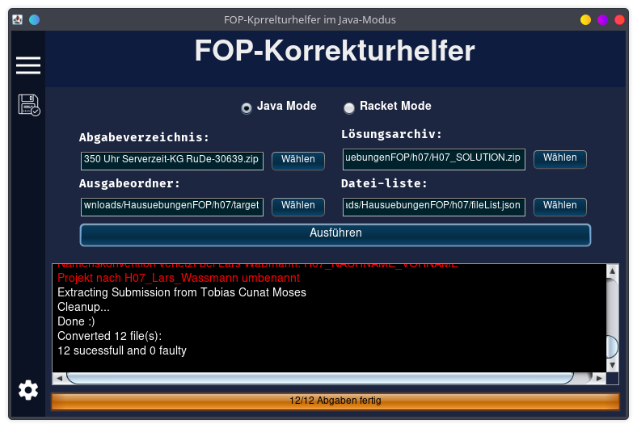

# FOP-Korrekturhelfer

## Benutzung
### Vorbereitung
- Abgaben Herunterladen ("Abgaben in Verzeichnissen herunterladen" **muss** aktiviert sein)
- Musterlösung herunterladen
- FileList.txt erstellen oder herunterladen
- **leeres** Ausgabeverzeichnis erstellen
- Beispielhafte Ordnerstruktur:
    - Hausuebung_07
        - FOP 2021-Abgabe - Hausübung 07 - bis 22.01.2021 2350 Uhr Serverzeit-KG RuDe-30639.zip
        - H07_SOLUTION.zip
        - fileList.json
        - target
### Programm nutzen
- Programm öffnen und im gui die heruntergeladenen Zip-Verzeichnisse und den Ausgabeordner wählen
- Ausführen drücken
- wenn alles klappt am Besten den log im Ausgabevertzeichnis speichern (Siehe Menüleiste Links)

### In Eclipse importieren
- Import project->Existing Projects into Workspace
- Dann bei select root directory den Ausgabeordner wählen
-  Viel Spaß beim Korrigieren :D

## Dateiliste Erstellen (Eintrag veraltet)
Die Dateiliste kann verwendet werden, um Dateien aus der Referenzlösung in alle Abgaben zu kopieren, oder deren Existenz zu prüfen. Dabei müssen alle in der Liste vorkommenden Dateien im Lösungsverzeichnis vorkommen, sonst werden sie ignoriert.  
Für Java-Projekte ist der folgende Befehl hilfreich:

```bash
find . -not -path "./bin/*" -not -path "./bin" -not -path "." -not -path "./.project" 
```

### Modi
- `assert_exists`: Gibt Warnung wenn Datei fehlt (wird **nicht** überschrieben)  
- `assert_not_exists`: Gibt eine Warnung wenn Datei existiert (z.B. sinvoll bei Tutorentests)
- `overwrite_always`: Überschreibt bzw. erstellt Dateien ohne Meldung  
- `copy_if_not_exists`: Kopiert nur wenn Datei noch nicht existiert (keine Meldung)
- `ignore`: ignoriert Dateien (z.B. sinvoll für bin ordner) 
    
Standartmodus Dateiliste: `assert_exists`  
Standartmodus für Dateien die nicht in der Liste Sind: `copy_if_not_exists`
## Selber Kompillieren
Falls die Fertige JAR-Datei nicht funktioniert, oder mann selbst die neuste Version kompillieren will geht das recht einfach:
- Das Github repo mit eclipse Clonen und das Projekt importieren
- Rechtsklick auf Projekt->Properties-> Resource->Text file encoding -> UTF-8 Wählen (falls nicht vorausgewählt)
- Die Run Configuration von MainGui oder ProjectCleaner nutzen (machen aktuell fast das gleiche)
## Bekannte Fehler
- Einige Optionen des JavaActionSetModels werden noch nicht berücksichtigt
- Racket Modus noch buggy

## Geplante Features
- Racket Modus
- Bessere Logs/Ausgaben (ggf als HTML)

## Mitwirkende
- Kim Berninger (Ersteller)
    - Base Structure
    - Gui
    - Command Line Mode
- Ruben Deisenroth
  - File Extractor
  - Quality of Life improvements
